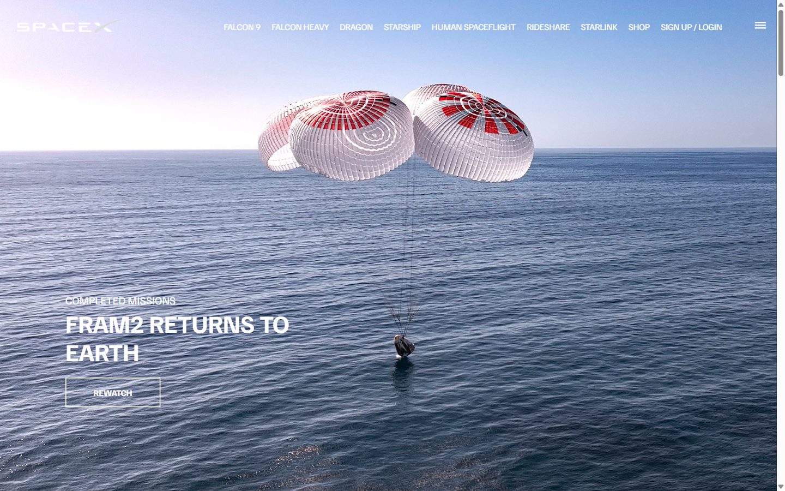
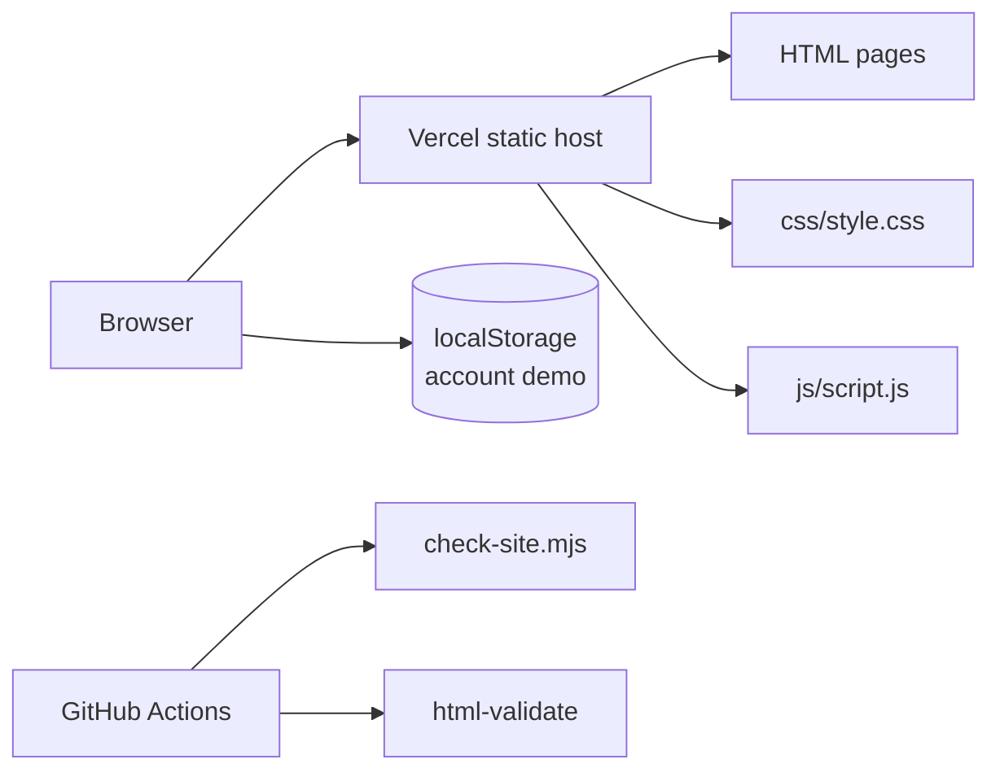

# spacexc

> A multi-page, SpaceX-inspired marketing site built with plain HTML, CSS and JavaScript and served as a static site on Vercel.

[](https://github.com/AkashNaickar/spacexc/actions/workflows/ci.yml)
[](LICENSE)
[](https://spacexc.vercel.app)

**[Live demo →](https://spacexc.vercel.app)**



## Features

- **Scroll-snapped mission landing** — the home page stacks full-viewport sections for completed, recent and upcoming missions (FRAM2, Starlink, SES-22, Globalstar FM15, Crew-9 and Human Spaceflight).
- **Vehicle pages** — dedicated Falcon 9, Falcon Heavy and Dragon pages with hero imagery, headline stats and an on-scroll counter animation.
- **Shop grid** — a responsive merchandise catalogue (3 columns on desktop, 2 on tablet, 1 on mobile) with hover image swaps and pricing.
- **Client-side account demo** — log-in and sign-up tabs with email and password-strength validation; the session is stored in `localStorage` and reflected in the header and mobile menu, with a working logout.
- **Responsive navigation** — the header hides as you scroll down and reappears on scroll up; a hamburger button opens a full-screen mobile menu with an overlay.
- **Metadata and accessibility basics** — a title and description on every page, labelled controls, `alt` text on images and a responsive viewport.

> This is a portfolio/learning recreation of the SpaceX marketing site. It is not affiliated with, endorsed by, or connected to Space Exploration Technologies Corp.

| Home | Shop |
|------|------|
|  |  |

## Tech stack

| Layer | Tech |
|-------|------|
| Markup | HTML5 — six hand-written pages |
| Styling | CSS3 — one custom stylesheet, no framework |
| Behaviour | Vanilla JavaScript (ES2015+), no dependencies |
| Tooling | Node.js + [html-validate](https://html-validate.org/) (CI only) |
| Hosting | Vercel (static) |
| CI | GitHub Actions |

## Architecture



There is no server and no build step: the pages, stylesheet and script are shipped as-is, and the account demo keeps its state entirely in the browser.

## Quick start

> No install or build step is required. These commands were run against a clean checkout.

```bash
git clone https://github.com/AkashNaickar/spacexc.git
cd spacexc
python -m http.server 8080
# open http://localhost:8080
```

Opening `index.html` directly in a browser also works, but serving over HTTP is recommended so that relative paths and the `localStorage` demo behave consistently.

## Configuration

There are no environment variables. The project is fully static and reads nothing from the environment. The account demo stores a single key in the browser:

| Storage key | Set by | Description |
|-------------|--------|-------------|
| `spacexcUser` | `account.html` | JSON blob for the demo session (`firstName`, `lastName`, `email`, `isLoggedIn`). Cleared on logout. |

## Testing

The CI workflow runs two checks, both of which can be run locally:

```bash
node scripts/check-site.mjs          # metadata, local links/assets, image alt text, duplicate ids
npx --yes html-validate@9 "*.html"   # HTML validation
```

`check-site.mjs` walks every `*.html` file in the repository root, verifies required `<head>` metadata, resolves each local `src`/`href` on disk, checks that every `` has an `alt` attribute and rejects duplicate `id`s.

## Deployment

The site is deployed as a static site on **Vercel** at <https://spacexc.vercel.app> (no environment variables or build command). A GitHub Pages workflow is also included at `.github/workflows/static.yml`, which publishes the repository root on pushes to `main`.

## Roadmap

- [ ] Wire the shop's **Add to cart** buttons to an actual cart (they are links only today).
- [ ] Replace the placeholder `#` links in the navigation and footer with real destinations or remove them.
- [ ] Add a visual-regression check once screenshots are generated in CI.

## Contributing

Issues and pull requests are welcome. See [`CONTRIBUTING.md`](CONTRIBUTING.md) and [`CODE_OF_CONDUCT.md`](CODE_OF_CONDUCT.md). For security reports, see [`SECURITY.md`](SECURITY.md).

## License

MIT — see [LICENSE](LICENSE).
